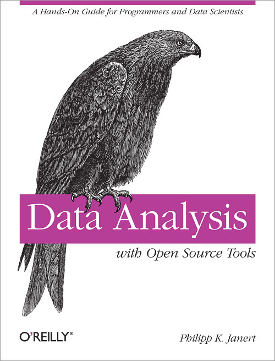

# Data Analysis with Open Source Tools

Examples and code for the book _Data Analysis with Open Source Tools_ 
by Philipp K. Janert (O'Reilly, 2010)

## Description

This repository contains the source code and data sets for the examples
in the book.

### Listings

The listings are in Python and C, and may require additional packages
or libraries to be installed. (See the book for details.)

Please note that the Python listings require Python2.

### Data Sets

Publicly available data sets are not replicated in this repository to
avoid possible copyright issues. Instead, the URLs where the data sets
can be found are given in a file called `PUBLIC_DATASETS`.

## Resources

- Catalog Page on O'Reilly: https://www.oreilly.com/library/view/data-analysis-with/9781449389802/

## Author

Philipp K. Janert
